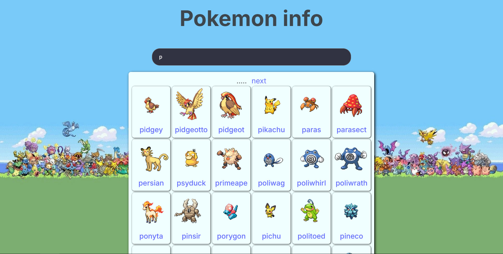

### Pokemons info

Pokémon Info es una aplicación web que permite a los usuarios explorar informacion sobre Pokémones. Utilizando la API PokéAPI, la aplicación proporciona datos destallados de pokémones, incluyendo peso, altura, numero de pokedex, tipo, debil contra, etc.

## Caracteristicas

- Buscar pokémones por nombre.
- Ver detalles de un pokémon, inclutendo, numero de pokedex, tipo, debil contra y más.


## Tecnologías

- **Frontend**: React con Typescript
- **API**: ([PokéAPI](https://pokeapi.co/))

## Instalación

Sigue estos pasos para ejecutar la aplicación en tu máquina local.

### Requisitos

- **Node.js**: Asegúrate de tener Node.js instalado.
- **pnpm** (gestor de paquetes de Node.js)

### Pasos para ejecutar la aplicación

1. Clona el repositorio:

```
  git clone https://github.com/matulai/My-Anime-Info.git
```

2. Navega a la carpeta del proyecto:

```
  cd my-anime-info
```

3. Instala las dependencias:

```
  pnpm install
```

4. Para ejecutar la aplicación, usa el siguiente comando:

```
  pnpm run dev
```